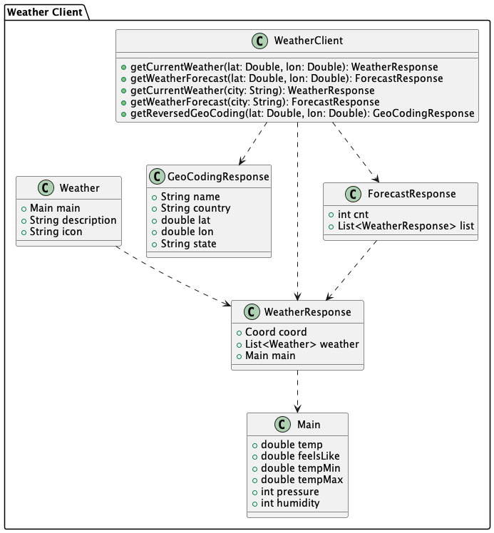

# CF Weather Data


CF Weather Data is a REST API service that provides weather information for specified coordinates. By supplying latitude and longitude, users can retrieve current weather conditions or a 5-day forecast for any location.

## Table of Contents
- [Overview](#overview)
- [Functionality](#functionality)
- [Usage](#usage)
- [Error Handling](#error-handling)
- [OpenAPI Documentation](#openapi-documentation)
- [Technologies Used](#technologies-used)
- [Setup and Installation](#setup-and-installation)
- [E2E Testing](#e2e-testing)


## Overview


## Functionality

Based on the longitude and latitude provided, the API can:

- Get current weather
- Get a forecast for the next 5 days

## Usage

To use the CF Weather Data API, make a GET request to the following endpoint and include the latitude, longitude, and type of data you want (current weather or forecast) as query parameters:

```
GET /api/weather?lat={latitude}&lon={longitude}&type=current|forecast
```

**Example requests:**

> Replace `{latitude}` and `{longitude}` with the desired coordinates. The API will return the weather data for the specified location.

For current weather data, use the following endpoint:
```
GET /api/weather?lat={latitude}&lon={longitude}&type=current
```
```json
{
	"dateTime": "2025-09-22T19:45:02",
	"location": "London",
	"temperature": 11.22,
	"main": "Clear",
	"description": "clear sky"
}
```

For the 5-day forecast (3-hour intervals), use the following endpoint:

```
GET /api/weather?lat={latitude}&lon={longitude}&type=forecast
```
```json
{
	"location": "London",
	"forecastDays": [
		{
			"dateTime": "2025-09-22T18:00:00",
			"minTemperature": 13.55,
			"maxTemperature": 14.87,
			"main": "Clouds",
			"description": "broken clouds"
		},
		{
			"dateTime": "2025-09-22T21:00:00",
			"minTemperature": 10.09,
			"maxTemperature": 11.9,
			"main": "Clouds",
			"description": "scattered clouds"
		}
        // ... more forecast data, in total 40 measurements covering the next 5 days in 3 hour intervals ...
    ]
}
```
## Error Handling

If the request is invalid or if there is an issue with the external weather service, the API will return an appropriate error message and description.

```json
{
    "timestamp": "2025-09-22T19:45:02",
    "error": "Invalid type parameter",
    "description": "The type parameter must be either 'current' or 'forecast'."
}
```

## OpenAPI Documentation

The API is documented using OpenAPI. You can access the OpenAPI documentation at:
[OpenAPI Specification (YAML)](backend/cf-weather-api/src/main/resources/static/api-docs/openapi.yaml)

## Technologies Used
- Java 21
- Spring Boot
- OpenAPI
- Maven
- Docker
- OpenWeatherMap API

## Setup and Installation

### Maven

Prerequisites:
- Java 21
- Maven
- Environment variable `WEATHER_API_KEY` set with your OpenWeatherMap API key.
- Environment variable `WEATHER_API_URL_JUNIT` set with the URL of a API for integration testing purposes.

To set up and run the CF Weather Data API locally, follow these steps:
1. Clone the repository:
   ```
   git clone
    ```
2. Navigate to the project directory:
   ```
   cd cf-weather-data/backend/cf-weather-api
   ```
3. Run the project using Maven:
   ```
   mvn spring-boot:run
   ```
4. The API will be accessible at `http://localhost:8080/api/weather`.

### Docker

Prerequisites:
- Docker
- OpenWeatherMap API key

To build and run the CF Weather Data API using Docker, follow these steps:
1. Clone the repository:
    ```
   git clone https://github.com/fresel/cf-weather-data.git
   ```
2. Build the Docker image:
   ```
   docker build -t my-weather-app .
   ```
3. Run the Docker container:
   ```
   docker run -d --rm  -p 8080:8080 -e WEATHER_API_KEY=<your_api_key> --name cf-weather my-weather-app
   ```
    >Replace `<your_api_key>` with your actual OpenWeatherMap API key.

4. The API will be accessible at `http://localhost:8080/api/weather`.

    >You can change the port mapping `-p 8080:8080` to use a different host port if needed. Use the format `-p <host_port>:<container_port>`. E.g., `-p 9090:8080` to map host port 9090 to container port 8080. Then access the API at `http://localhost:9090/api/weather`.

### Docker Compose

Prerequisites:
- Docker
- OpenWeatherMap API key

To build and run the CF Weather Data API using Docker Compose, follow these steps:
1. Clone the repository:
    ```
    git clone https://github.com/fresel/cf-weather-data.git
    ```
2. Navigate to the project directory:
    ```
    cd cf-weather-data
    ```
3. Create a `.env` file in the root directory and add your OpenWeatherMap API key:
    ```
    WEATHER_API_KEY=<your_api_key>
    ```

4. Alternatively, you can set the environment variable directly in your terminal session:
    ```
    export WEATHER_API_KEY=<your_api_key>
    ```
    ...or provide it inline when starting Docker Compose:
    ```
    WEATHER_API_KEY=<your_api_key> docker-compose up
    ```
5. Start the application using Docker Compose:
    ```
    docker compose up
    ```
    >Replace `<your_api_key>` with your actual OpenWeatherMap API key.

6. The API will be accessible at `http://localhost:8080/api/weather`.

## E2E Testing

E2E testing can be done by using HttpYac.
See the httpyac [documentation](https://httpyac.github.io/) for more information.

> Note: You need the API Key set in the environment variable `WEATHER_API_KEY` and the API must be running to perform the tests.

1. Install HttpYac from [here](https://httpyac.github.io/).
2. Open the `backend/cf-weather-api/httpyac` folder in HttpYac.
3. Update the `baseUrl` variable in `backend/cf-weather-api/e2e/local.env` if you are not running the API on `http://localhost:8080`.
4. Run the requests in `backend/cf-weather-api/e2e/weather.http` to perform E2E testing.

## Design

### API Sequence Diagram


###  Weather Client Class Diagram


### Weather Client Sequence Diagram


## Future Improvements
- OpenAPI documentation and Swagger UI accessibility.
- Add caching to reduce the number of requests to the external weather service?
- Implement authentication and authorization for the API.
- Add more detailed error handling and logging.
- Use https for the API in the Docker container.
